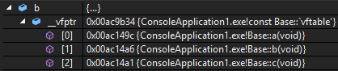
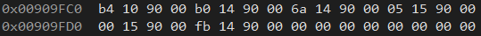
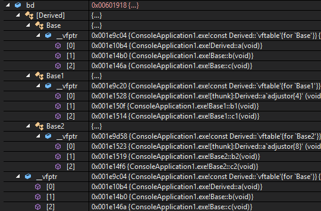

[c/c++, programming language 编程语言]

# C++虚函数

C++中有编译时多态和运行时多态，运行时多态是由虚函数实现的。虚函数是用过虚函数表（vftable，virtual function table）来实现的，这个表包含了这个类的虚函数地址，解决了继承、覆盖。当使用父类指针来操作一个子类对象的时候，通过子类对象的虚函数表指针（vfptr，virtual function table pointer）找到子类的vftable，进而找到应该调用的函数。

# 虚函数表

当一个类声明了虚函数或者继承了带有虚函数的父类，这个类就会有自己的vftable。vftable的实现大都为一个函数指针数组，每个函数指针指向该类的一个虚函数，同时该类的每个对象都会包含一个vfptr，vfptr指向vftable。

```cpp
class Base
{
public:
	virtual void a() { cout << "Base::a" << endl; }
	virtual void b() { cout << "Base::b" << endl; }
	virtual void c() { cout << "Base::c" << endl; }
	virtual void d() { cout << "Base::d" << endl; }
};
```

定义一个`Base`类型对象，`Base b`，`b`的vfptr如下：



* address of vfptr: `&b`,
* address of vftable: `*(int*)(&b)`,
* address of the first function in vftable: `(int*)(*(int*)(&b))`,
* the first function pointer: `(void(*)(void))*(int*)(*(int*)(&b))`,
* the second function pointer: `(void(*)(void))*((int*)*(int*)(&b) + 1)` or `(void(*)(void))*(int*)(*(int*)(&b) + 4)`,
* the third function pointer: `(void(*)(void))*((int*)*(int*)(&b) + 2)` or `(void(*)(void))*(int*)(*(int*)(&b) + 8)`.

# 一般继承

## 无虚函数override

对于一般继承、无虚函数override的情况，虚函数按照声明顺序放在表中，父类的虚函数在子类的虚函数前。

## 有虚函数override

如果有覆盖，那么被覆盖的虚函数被替换为子类中的函数，没有被覆盖的虚函数不变。

```cpp
class Derived : public Base {
public:
	void a() { cout << "Derived::a" << endl; }
	virtual void ad() { cout << "Derived::ad" << endl; }
	virtual void bd() { cout << "Derived::bd" << endl; }
	virtual void cd() { cout << "Derived::cd" << endl; }
};
```

定义一个`Base`类指针，`Base* bd = new Derived()`，`bd`的vfptr下如下：


上图并未列出在`Derived`定义的三个函数，查看`bd`处内存，



前12 byte是前面列出的，接下来的12 byte就是`Derived::ad()`、`Derived::bd()`和`Derived::cd()`，可以通过`((void(*)(void))*((int*)*(int*)bd + 3))()`等调用。

# 多重继承


## 无虚函数override

对于没有虚函数覆盖的多重继承，每个父类都有自己的虚函数表，按照声明顺序，子类的成员函数被放到了第一个父类的表中。

## 有虚函数override

如果有虚函数覆盖，那么每个父类虚函数表中被覆盖的虚函数被替换为子类的函数指针。

```cpp
class Base1
{
public:
	virtual void a() { cout << "Base1::a" << endl; }
	virtual void b() { cout << "Base1::b" << endl; }
	virtual void c() { cout << "Base1::c" << endl; }
	void d() { cout << "Base1::d" << endl; }
};

class Base2
{
public:
	virtual void a() { cout << "Base2::a" << endl; }
	virtual void b() { cout << "Base2::b" << endl; }
	virtual void c() { cout << "Base2::c" << endl; }
	void d() { cout << "Base2::d" << endl; }
};

class Derived : public Base, public Base1, public Base2 {
public:
	void a() { cout << "Derived::a" << endl; }
	virtual void ad() { cout << "Derived::ad" << endl; }
	virtual void bd() { cout << "Derived::bd" << endl; }
	virtual void cd() { cout << "Derived::cd" << endl; }
};
```

定义一个`Base`类指针，`Base* bd = new Derived()`，`bd`的vfptr下如下：



三个vfptr可分别由`(int*)*(int*)bd`、`(int*)*((int*)bd+1)`和`(int*)*((int*)bd+2)`得到，或者以数组的方式`(int*)(((int*)bd)[0])`、...。

# 访问non-public函数

只要有类中定义了虚函数，那么一定有虚函数表。通过指针访问虚函数表的方式，就算虚函数是non-public的，也能够访问到。

```cpp
class Derived1 {
private:
	virtual void ad() { cout << "Derived1::ad" << endl; }
	virtual void bd() { cout << "Derived1::bd" << endl; }
	virtual void cd() { cout << "Derived1::cd" << endl; }
};

Derived1* bd1 = new Derived1();
pf = (void(*)(void))*((int*)*(int*)bd1);
pf();
```

# 编译环境

Visual Studio 2015, platform x86。在Visual Studio 2015、platform x86下, `sizeof(int) = 4`, `sizeof(int*) = 4`。

如果是x64，则`sizeof(int*) = 8`，那么无论是在LP64（Linux常用）下，还是在LLP64（Windows）下，`(int*)(*(int*)(&b))`并不能得到vftable中第一个函数的正确地址，解引用截断了高4 byte，把高4 byte的值作为`int`。如果vftable的正确地址是`0x00007ff6 1f5aaf08`，那么`(int*)(*(int*)(&b))`得到的是`0x00000000 1f5aaf08`。

与此同时，不同的编译器对vfptr和vftable可能有不同的实现方式，上述访问方法不一定能够在其他编译器中使用。

# References

1. [Data model](http://www.viva64.com/en/t/0012/)
2. [C++虚函数浅析](http://glgjing.github.io/blog/2015/01/03/c-plus-plus-xu-han-shu-qian-xi/)
3. [C++ 虚表解析](http://blog.csdn.net/haoel/article/details/1948051)
4. [对陈皓博客《C++虚函数解析》的补充](http://www.rudy-yuan.net/archives/128/)