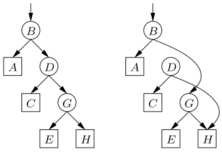
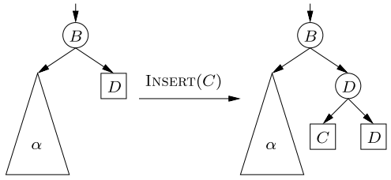
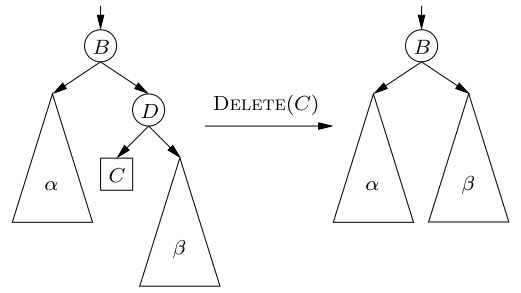
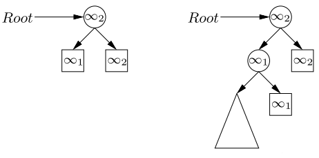

@(thought)[concurrency 并发, data structures and algorithms 数据结构和算法]

# Notes of Non-blocking Binary Search Trees

# specification

* no duplicated key
* deleting non-existent key leads to return false
* leaf-oriented BST

	> * all keys currently in the dictionary are **stored in the leaves of the tree.**
	> * Internal nodes of the tree are used to direct a Find operation along the path to the correct leaf.
	> * The keys stored in internal nodes may or may
not be in the dictionary.

# features

* non-blocking
* linearizable

	> for every execution, one can assign a linearization point to each completed operation and some of the uncompleted operations **so that the linearization point of each operation occurs after the operation starts and before it ends**, and the results of these operations are the same *as if they had been performed sequentially, in the order of their linearization points.*

# basic idea

类似Harris' Linked List里面的做法，这里是mark the parent of the leaf before
splicing that parent out of the tree。一旦被标记，那么其指向子结点的指针将不能被改变。

# problems

上图中，两个线程分别delete C和E，两个concurrent operation同时看到了BST以后，接下来的操作是，*基于各自看到的的BST来进行的*，它们彼此并不知道对方进行了什么操作，最后导致E并没有被deleted，其中一个操作丢失了。

解决这个需要对parent的child pointer进行mark，但是要mark的pointer是存在两个不同的word（left and right child pointer）里面的，不能够用一个cas来同时mark。

# solutions

using a separate state **field of the node** to mark or flag，而不是mark那个pointer。

* mark: node marked is unchangeable。
* flag: indicate that an update is trying to change a child pointer of the node.

mark和flag类似于加锁。

## insert和delete

### insert

Insert (C):
1. flag node D's parent, node B,
2. change the appropriate child pointer of node B,
3. unflag node B.

### delete

Delete (C):
1. flag C's grandparent, node B,
2. mark C's parent, node D,
3. change the appropriate child pointer of B,
4. unflag node B.

insert在完成第一步以后，在insert进行后续操作时，其他线程将不能够block insert。delete类似的，在完成第一二步以后也是。

但是delete在完成第一步以后，第二步mark有可能失败，比如insert把将要删除的node换为新的三个node。in which case the flag is no longer on the node whose child pointer must be changed to accomplish the deletion.

如果mark失败，delete会remove flag，重新开始。

# some details in implementation

## helping mechanism

### method

类似Barnes的方法，将线程拥有lock换成操作拥有lock（marked or flagged）。一个操作在处理tree的同时，还保存了它在holding lock的时候要进行的操作，其他线程遇到lock，就帮助它完成，使得lock最终release。

为了避免helping mechanism带来的性能下降（多个线程会尝试进行同一个操作），这里用了保守的策略： a process P helps another process's operation **only if the other operation is preventing P's own progress**.

### implementation

线程之间是无法自动感知对方的存在的，也就是说实现helping mechanism，需要a data structure that is shared between threads holds the operating information。

## dummy keys

在delete时，需要flag grandparent和mark parent，如果BST的key少于4个，必然就会有一个leaf没有grandparent，那么在delete就需要考虑很多例外的情况（insert类似）。

为了避免这些特殊情况，下面引入两个特殊值$\infty_1$和$\infty_2$，使得BST在没有key的时候，也存在3个node。这两个dummy keys是不允许删除的。

# summary

1. **Excellent tutorial** about helping mechanism!!!
2. 在树上面进行并发操作的时候，这篇论文中描述的问题其实大都是存在的，因此论文中的方法可以考虑用到其他树型结构上面。

# references

1. Non-blocking Binary Search Trees, Faith Ellen, Panagiota Fatourou, Eric Ruppert, Franck van Breugel