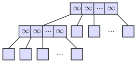
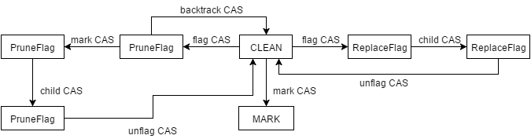
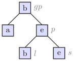

[concurrency 并发]

# Notes of Non-blocking k-ary Search Trees

Brown在Toronto大学读PhD期间写过2篇关于k-ary的文章，他读PhD期间的导师是Ellen，而Ellen正是写了Non-blocking Binary Search Trees的那位。这篇文章里看到了好几个methods或者ideas是extended from Non-blocking Binary Search Trees。

# About k-ary Search Trees

* No duplicate key
* Leaf-oriented k-ST
* Each leaf has zero children and at most k - 1 keys
* Each internal node has exactly k children and k − 1 keys (in increasing order)

Non-blocking k-ary Search Trees需要平衡，tree的深度和每个internal node进行search和update时的work总量。

大的k-->减少tree的depth，但是增加了每个internal node进行search和update时的work总量。

k = 4的时候，在高contention和低contention的情况下，性能都是最好的。
高contention时，较少的小k减少了update时影响到的key的数目，增加了并行度；低contention时，较少的depth加快了search，加快了update。

# From BST to k-ary Search Trees

* Insert: the BST's insertion -> sprouting insertion
* Delete: the  BST's deletion -> pruning deletion
* Coordination: extended from BST

# Data Structure

## Nodes

Each **leaf** has zero children and **at most** k − 1 keys (zero keys is permitted). Each **internal node** has exactly k children and k − 1 keys. Inside each node, keys are maintained in **increasing order**.

## Dummy Nodes

Dummy nodes are used in BST to avoid special cases when there is no parent or grandparent to flag and mark. The following pruning deletion operation will meet similar problem. When perform pruning deletion, the leaf may *won't have a parent or grandparent*. To avoid dealing with that, **dummy nodes** and **empty leaves** used again when initializing the tree.



* Dummy nodes: each have k − 1 keys valued $\infty$.
* Empty leaves: 2k - 1 empty keys in total.

# Sequential Operations

## Insertion

Search for the key first.

### Sprouting Insertion

If the leaf is full, replaces the leaf by a *newly created* subtree.

The newly created subtree:

* The k - 1 greatest keys among the original k - 1 keys and the new key.
* The children are k (the original k - 1 keys and the new key) *new* nodes.

### Simple Insertion

If the leaf is full, replaces the leaf by a *newly* leaf with k keys (the original k - 1 keys and the new key).

## Deletion

First search for the key.

### Pruning Deletion

If the leaf has one key **and** the parent of leaf has *exactly two non-empty children*, replace the parent with the sibling of leaf.

### Simple Deletion

If the leaf has more than one key **or** the parent of leaf has more than two non-empty children, replace the leaf by a *new* leaf with key removed.

# Coordination

Interleaved execution between concurrent updates in some particular order may cause problems (of cause).

The Coordination is similar to BST, but here the scheme is extended.

The following `UpdateStep` (`ReplaceFlag`, `PruneFlag` and `Mark`) objects is just like lock.

## ReplaceFlag

For both types of insertion and simple deletion.

## PruneFlag

For pruning deletion.

## Mark

Before an internal node is to disappear from the tree, it must first be marked. Once a internal node is marked, its child pointer will never be changed.

## Clean

Initial stat of the `pending` filed in internal node.

# Help Mechanism

If an operation is unexpectedly delayed while holding access to a flagged or marked node, the progress cannot be guaranteed. So helping mechanism is necessary. The method taken here is similar to the one in BST.

But the helping **should not be abused**. To avoid many *duplicate operation*, the helping is used in limited cases.

# On The Whole

Just for clear the thought.

The following picture isn't presented in the paper. Because the idea in the paper is similar to BST. So it easy to imitate the original one in BST.



`ReplaceFlag` is used in simple insertion, sprouting insertion and simple deletion. So the original notations, `ichild ...`, `dchild ...`, etc won't apply.

# Differences between BST and k-ary Search Trees

## Deletion

There two types of deletion in k-ary Search Trees. And a particular interleave of insertion and deletion would result in key lost.



Suppose there are some nodes in k-ary search tree (see above figure) and two threads concurrently perform update.

* Thread ti: insert d at b (the order doesn't mater)
* Thread td: delete b

The following operation sequence is executed (direction of child isn't mentioned, but it should be fairly easy to see),

1. td: `PruneFlag` gp
2. ti: `ReplaceFlag` p
from now on, the p won't be marked by td until ti finished.
3. ti: Finish insertion and `Clean` p
4. td: Mark p
5. td: Change the pointer in gp to s

**Consequence:** Insertion of key, d is lost. :(

The problem is that pruning deletion changes the child of gp to the child of p without knowing the modification in the another child of p.

Above problem won't happen in BST's deletion, *since the new node (internal node or leaf) is always built from scratch.*

So the `pending` of p must be read before `PruneFlag` set at gp and checked when performing mark cas. If any insertion occurred, the `pending` of p will be bound to changed and deletion will perform backtracking cas and restart.

BTY: In BST and k-ary search tree, the `pending` of p is already  read by the end of search and the above prerequisites in implementation is **already done**. *But it has special purpose and meaning here.*

# Some Doubts

## CAS and CASet

In k-ary search trees, CASet (compare-and-set) is used to implement CAS.But the prerequisites is the algorithm doesn't suffer from the ABA problem.

```
x.CAS(expect, value)
  result = read(x)
  if (result != expect) return result
  if (x.CASet(expect, value)) return expect
  return read(x)
```

The reason why these algorithms doesn't suffer from ABA problem is quite clear for me. But what does the prerequisites (doesn't suffer from the ABA) for?

# References

1. Non-blocking k-ary Search Trees, Trevor Brown, Joanna Helga
2. Non-blocking Binary Search Trees, Faith Ellen, Panagiota Fatourou, Eric Ruppert, Franck van Breugel