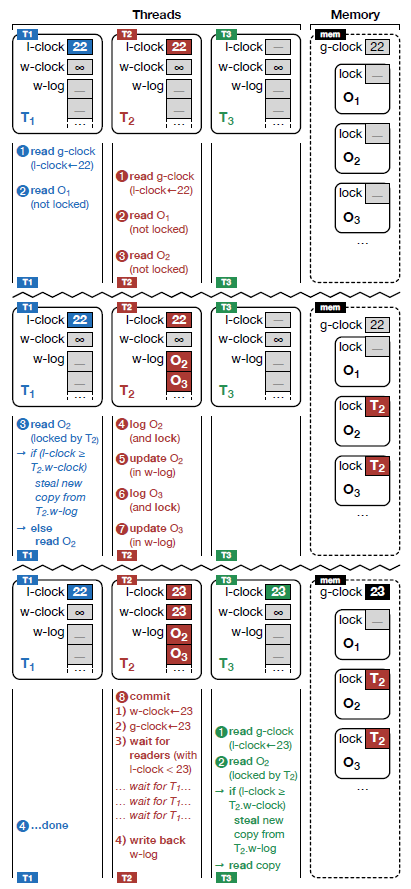

[concurrency 并发]

# Notes of Read-Log-Update A Lightweight Synchronization Mechanism for Concurrent Programming

# Introduction

RCU, this barrier-based mechanism, allows for simple epoch-based reclamation of the old copies, and the mechanism as a whole eliminates many of the atomic read-modify-write instructions, memory barriers, and cache misses that are so expensive on modern multicore systems.

## About RLU

* Novel extension of RCU framework that support read-only traverals concurrently with multiple updates.
* In a semi-automated way.
* Removes from the programmer the burder of handcrafting the concurrent copy management using only single pointer manipulations.
* Can be API-compatible with RCU.

## About Implementation of RLU

* Clock-based logging mechanism.
* Object-level write-log per thread.

# Algorithms

## Idea

```c
// For all operations:

   +--------------+
   |all operations|
   +------+-------+
          |
          |
+---------v-----------+
|read the global clock|
+---------+-----------+
          |
          |
       +--v--+
       |start|
       +-----+

// For writer:
                              +------+
              +--+            |writer|
              |               +---+--+
              |                   |
              |                   |
              |     +-------------v-------------------------------+
              |     | copy the object into a its own              |
modification<-+     |thread wirte-log and lock the original object|
              |     +-------------+-------------------------------+
              |                   |
              |                   |
              |      +------------v-------------+
              |      |manipulate the object copy|
              +---+  +------------+-------------+
                                  |
                                  |
            +---+    +------------v------------------------------+
            |        |increments the write clock and global clock|
            |        +------------+------------------------------+
            |                     |
            |                     |
            |      +--------------v----------------+
            |      |splits operations into two sets|
            |      +--------------+----------------+
            |                     |
    commit<-+                     |
            |     +---------------v-----------------+
            |     |wait for old operations to finish|
            |     +---------------+-----------------+
            |                     |
            |                     |
            |     +---------------v--------------------+
            |     |   write back the new objects       |
            |     |from the writer-log into the memory,|
            |     |  overwriting the old objects,      |
            |     |      release the locks             |
            +---+ +------------------------------------+
```

The writer's modifications are:
* hidden from concurrent reads,
* avoid conflicts with concurrent writes.

In the following figure, **the order of updating new value**, 23, at write-clock and global-clock is important. Because all new object copies of the write-log become visible at once to all concurrent RLU protected section **after the increment of global clock**.



Many of the lock mentioned is not really calling `pthread_mutex_lock()` but just performing a update at a specific filed in data.

Until now, the synchronization between write and write is not mentioned.

## Synchronizing Write Operations

Two approaches:

* Execute writers serially.
* Fine-grained locks.

### Execute Writers Serially

Using a global lock for each writer is simplicity of the code and the concurrency that does exist between read-only and write operations.

But the drawback is a lack of scalability.

### Fine-grained Locks

Each object that a writer modifies is logged and locked (as shown in the former figure) by the RLU mechanism.

## Fine-grained Locking Using RLU

RLU locks can be used as a fine-grained locking mechanism.

For standard lock, it is necessary to execute post-lock customized verifications to ensure that the state of the object is still the same as it was before locking. This action is unnecessary for RLU locks.

## Data Structures

Global:

* a global clock
* a global array of threads

Thread:

* two write-logs: new object copies
	* header:
		* a thread indentifier
		* a pointer: point to the actual object
		* the object size
		* a special pointer value that indicates this is a copy (constant)
* a run counter: the thread is active or not
* a local clock: stealing mechanism
* write clock for each thread: stealing mechanism
	* write clock of a thread is initially $\infty$ and write clock is updated first (than global clock), so stealing from a thread is only possible when is updates the write clock during the commit

Object header:

* a pointer: points to the copy of this object in a write-log

**Note:** The actually code is the way of much more complex than previously mentioned. But these code are also nice course of programming in C.

# RLU Deferring

```c
+----------------------------------+
|writer saves the current write-log|
|and generates new log for the next|
|writer                            |
+---------+------------------------+
          |
          | if a writer tries to lock an object
          | that is already locked
          |
+---------v---------------------------+
|writer sends a "sync request" to     |
|the conflicting thread to force it to|
|release it locks                     |
|                                     |
|(global-clock++ -> rlu sync ->       |
| write back -> unlock                |
+-------------------------------------+
```

# References

1. Read-Log-Update: A Lightweight Synchronization Mechanism for Concurrent Programming, Alexander Matveev, Nir Shavit, Pascal Felber, Patrick Marlier