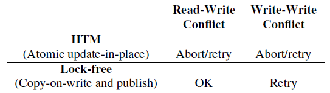

[concurrency 并发, data structures and algorithms 数据结构和算法]

# Notes of To Lock, Swap, or Elide On the Interplay of Hardware Transactional Memory and Lock Free Indexing

主要研究了HTM and lock-free indexing的相互影响。

## 解决了这么几个问题

* Does HTM obviate the need for crafty lock-free index designs?
No.

* How does HTM differ from lock-free index designs?

* Given that lock-free designs are still relevant, can HTM help simplify lock-free design techniques while maintaining good performance?
Yes.

## HTM

### Transactional memory

ease the burden (*a tedious and error prone task leading to deadlocks and race conditions*) by delegating conflict detection and resolution from the developer to the system.

### Hardware Transactional Memory

a best-effort model, optimistic concurrency.

#### Based on existing features in CPU

* caches
store transaction buffers and provide isolation.

* cache coherence protocol
detect conflicting transactional accesses.

#### Constraints

* read and write set of a transaction must fit in cache in order for it to be executed
limitation of CPU.

* transaction duration
hardware events will abort a transaction.

* the work of conflict detection
it is usually done at the granularity of a cache line. This may lead to cases of false sharing where aborts occur due to threads accessing and modifying separate items on the same cache line.

#### Solutions - lock elision

因为HTM是best-effort的，由于上述constraints的存在，transaction需要fallback path。

最简单的一种，是transaction不成功的时候，就改用lock，这个技术叫做lock elision；它将一个lock保护的区域作为transaction来执行，仅当transaction 没有成功commit的时候，它才falls back为block on the lock。

lock elision将MT作为一个fast path，slow path就是lock (a simple coarse grain locks).

In lock elision, the lock word needs to be included in the read set of a transaction, so that the transaction aborts when another thread acquires the lock (thus causing a conflict). Hence, once a thread resorts to non-transactional execution by taking the lock, **all other concurrently executing transactions will abort, stalling overall progress.**

### Intel TSX

the support of transactional memory in Intel starts from Haswell.

According to Intel, there is no guarantee that a transaction
will eventually succeed even if it is infinitely retried.

* HLE
Hardware Lock Elision (HLE)

* RTM
Restricted Transactional Memory (RTM)

### cpp-btree and Bw-tree

cpp-btree
* does not contain the fine-grained locking techniques and concurrency protocols

Bw-tree
* a mapping table that maps logical page identifiers (LPIDs) to virtual addresses

* Lock-free updates
	* delta record
	* pages consolidation (to get search-optimized page)

* Structure modifications
	* breaks an SMO into a sequence of atomic steps

## A study of fundamental differences between HTM-based and lock-free index designs

### Experiment 1 - Throughput

#### Results

for read operation, HTM provides high throughput with little effort.

### Experiment 2 - Effect of Key and Payload Sizes

#### Analysis

such a workload in experiment 1 **do not hold in general**.

* capacity limits *(for Haswell’s CPU)*
L1 cache is 32KB. no transaction can write more than can fit in L1.

* associativity *(for Haswell’s CPU)*

* hyper-threading *(for Haswell’s CPU)*
L1 cache and other resources is shared among hardware threads.

> many of the properties that determine the HTM abort rate for a given tree may not be known until runtime. A tree’s key size, payload size, total size, and address access patterns all affect performance.

#### Results

even trees with relatively small keys and payloads cannot always parallelize. With Haswell's HTM almost all transactions abort with payloads larger than a few kilobytes.

### Experiment 3 - Highcontention Performance

#### Analysis

* two other problematic ways
	* speculation is not free

	* lemming effect
	When a transaction falls back and acquires the lock, **all other transactions in the critical section** abort and cannot restart **until the lock is released**. The effect is that execution is **fully serialized** until the lock is released – even if the other transactions operate on non conflicting cache lines.
		* mitigate the lemming effect
		have transactions retry more than once
		*cost of retrying a contentious transaction < serializing execution*

#### Results

*the workload skew: for the payload, the bigger the skew is, the latter it is updated at the end of a tree traversal operation, and the latter it is within the transaction.*

The results show that as workload skew increases **the performance of lock-elision drops sharply**. At some point lock-elision performs even **worse than spin-locks**. Increasing the number of transactional attempts delays the performance cliff, and leads to a more graceful degradation of performance as skew increases.

#### Optimal Number of Transactional Attempts

for a set of concurrent transactions, it may be possible that none of them commit: a situation worse than using a spinlock.

The optimal number of transactional attempts depends on workloads and varies highly. chooses the number of transactional attempts dynamically depending on the workload.

### Lock-coupling

lock-coupling is one of the most widely used approaches to achieve efficient fine-grained locking on B-Trees.

In lock-coupling a pair of locks are held as a worker traverses pages: one on a "source" page and another on a "target" page.

Because of restrictive support of lock-coupling in Haswell’s HTM interface, it is not possible on Haswell’s CPU.

## A study of fundamental differences between HTM-based and lock-free index designs

### Experiment 1 - Impact of concurrent writers on readers

#### Results

for high contention workloads the reader throughput that the cpp-btree can sustain begins to drop.

### The Overheads of LockFreedom

* a garbage-collection mechanism for memory safety
	* epoch mechanism used in Bw-tree，类似引用计数。

* additional indirection for atomic updates
*lockfreedom influences the in-memory layout of structures*
	* 对于某些数据结构，如：Bw-tree，每次访问必须间接的通过一个额外的memory来进行，这就无形中增加了overheads。
	* 额外的indirection同时还给内存分配带来压力。
		* 可能需要特别的或者lock-free的allocator。

* cost of copy-on-write (when using paged copy-on-write semantics)
	* the cost may be influenced by page size, access skew, the uniformity of payload sizes.

These costs are highly intertwined: tradeoffs for each influence the cost of the others

## A study of how HTM can help lock-free designs

it is very difficult to architect and build complex lock-free
data structures.

### MultiWord CAS using HTM

* MW-CAS同时操作的word数受限于L1 cache的大小。过多的word，则无法用HTM来实现MW-CAS。Bw-tree可以。
* MW-CAS是短时的transactions，也就是说不那么容易被interrupted。

## References

1. [Lock elision in the GNU C library](https://lwn.net/Articles/534758/)
2. [Transactional Synchronization Extensions](https://en.wikipedia.org/wiki/Transactional_Synchronization_Extensions)
3. CPU Cache and Memory Ordering, 何登成
4. [This is a basic Cache Tutorial](http://www.ecs.umass.edu/ece/koren/architecture/Cache/tutorial.html)
5. Computer Systems A Programmer's Perspective, Randal E. Bryant, David R. O'Hallaron
6. To Lock, Swap, or Elide: On the Interplay of Hardware Transactional Memory and Lock Free Indexing, Darko Makreshanski, Justin Levandoski, Ryan Stutsman