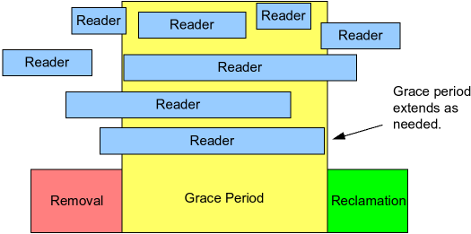
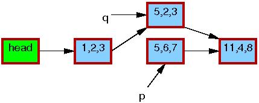

@(thought)[concurrency 并发, programming language 编程语言, linux]

# RCU

# Brief Introduction

1. a **synchronization mechanism**.

2. allowing read to occur concurrently with updates.

3. supports concurrency between a **single updater and multiple readers**.

4. ensures that reads are coherent by maintaining multiple versions of objects and ensuring that they are not freed up until all pre-existing read-side critical sections complete.

5. defines and uses efficient and scalable mechanisms for publishing and reading new versions of an object, and also for deferring the collection of old versions.

6. read-side primitives have zero overhead in non-preemptable kernels.

# Fundamental Mechanisms

1. Publish-Subscribe Mechanism (for insertion)
2. Wait For Pre-Existing RCU Readers to Complete (for deletion)
3. Maintain Multiple Versions of Recently Updated Objects (allow readers to tolerate concurrent insertions and deletions)

## Publish-Subscribe Mechanism (insertion)

RCU uses what can be thought of as a publish-subscribe mechanism to provide *the ability to safely scan data, even though that data is being modified concurrently.*

```c
// not good
struct foo {
  int a;
  int b;
  int c;
};
struct foo *gp = NULL;

/* . . . */

p = kmalloc(sizeof(*p), GFP_KERNEL);
p->a = 1;
p->b = 2;
p->c = 3;
gp = p;
```

### Problem 1 - `rcu_assign_pointer()`

The **memory reordering** in updater may cause that concurrent readers could see the uninitialized values (`gp`). And this requires to use **memory barriers (hard)** to keep things ordered.

The primitive, `rcu_assign_pointer()`, encapsulates these memory barriers.

The `rcu_assign_pointer()` would **publish** the new structure, forcing both the compiler and the CPU to execute the assignment to `gp` after the assignments to the fields referenced by `p`.

```c
// gp = p;
rcu_assign_pointer(gp, p);
```

### Problem 2 - `rcu_dereference()`

```c
// not good
p = gp;
if (p != NULL) {
  do_something_with(p->a, p->b, p->c);
}
```

Not only the updater but also the reader requires enforce ordering because of the **value-speculation compiler optimizations** (the compiler guess the value p, access its filed, then fetch the actual value of p and check the guess) in the context of **profile-driven optimization**.

```c
rcu_read_lock();
p = rcu_dereference(gp);
if (p != NULL) {
  do_something_with(p->a, p->b, p->c);
}
rcu_read_unlock();
```

The `rcu_dereference()` primitive can thus be thought of as **subscribing** to a given value of the specified pointer, guaranteeing that subsequent dereference operations *will see any initialization that occurred before the corresponding publish (`rcu_assign_pointer()`) operation*.

The `rcu_read_lock()` and `rcu_read_unlock()` calls are absolutely required: they define the extent of the **RCU read-side critical section**. In non-`CONFIG_PREEMPT` kernels, they generate absolutely no code.

### Special RCU Variants

Special RCU variants of Linux's list-manipulation API contains `rcu_assign_pointer()` and `rcu_dereference()` primitives.

Doubly linked list in Linux:

* the circular `struct list_head`
* the linear `struct hlist_head`/`struct hlist_node` pair

### RCU Publish and Subscribe Primitives

|Category|Publish|Retract|Subscribe|
|-|-|-|-|
|Pointers|`rcu_assign_pointer()`|`rcu_assign_pointer(..., NULL)`	|`rcu_dereference()`|
|Lists|`list_add_rcu()` `list_add_tail_rcu()` `list_replace_rcu()`|`list_del_rcu()`|`list_for_each_entry_rcu()`|
|Hlists|`hlist_add_after_rcu()` `hlist_add_before_rcu()` `hlist_add_head_rcu()` `hlist_replace_rcu()`|`hlist_del_rcu()`|`hlist_for_each_entry_rcu()`|

The `list_replace_rcu()`, `list_del_rcu()`, `hlist_replace_rcu()`, and `hlist_del_rcu()` introduce a new problem. When is it safe to free up the data element that was replaced or removed?

## Wait For Pre-Existing RCU Readers to Complete (deletion)

RCU is a way of waiting for lots of (for example, 20,000) different things to finish without having to explicitly track each and every one of them.

### About Waiting



The things waited on RCU read-side critical sections, which can be **nested, and may contain pretty much any code, as long as that code does not explicitly block or sleep **(**SRCU** is a special case).

When readers are not inside a read-side critical section, they are in a **quiescent state**.

A time period during which all such pre-existing readers complete is called a **grace period**. (or a period of time during which every
thread goes through at least one quiescent state is called a
grace period.)

If the section begins after the beginning of a given grace period, the execution of that section will extend beyond the end of that grace period. Because after the beginning of a given grace period, *new readers won't hold a reference to old data.

```c
struct foo {
  struct list_head list;
  int a;
  int b;
  int c;
};
LIST_HEAD(head);

/* . . . */

p = search(head, key);
if (p == NULL) {
  /* Take appropriate action, unlock, and return. */
}
q = kmalloc(sizeof(*p), GFP_KERNEL);

// the following 4 lines gives RCU its name:
// 1. while permitting concurrent reads,
// 2. *q = *p copies,
// 3. q->b = 2, q->c = 3, list_replace_rcu(&p->list, &q->list) do an update.

*q = *p;
q->b = 2;
q->c = 3;

// three main steps of the basic form of algorithms that use RCU to wait for readers
// 1. make a change
list_replace_rcu(&p->list, &q->list);
// 2. wait for all pre-existing RCU read-side critical sections to completely finish
// the key observation here is that subsequent RCU read-side critical sections have no way to gain a reference to the newly removed element.
synchronize_rcu();

// 3. clean up
kfree(p);
```

### `synchronize_rcu()`

#### The Trick

The trick is that RCU read-side critical sections is **not permitted to block or sleep**.

If a given CPU executes a context switch, **the completion** of any prior RCU read-side critical sections is guaranteed.

I think there must be an mechanism that the given CPU can *detect the existence of all RCU read-side critical sections and complete them* before the context switch.

```c
// simplified synchronize_rcu()
for_each_online_cpu(cpu)
    run_on(cpu);
```

`for_each_online_cpu(cpu)` loop through all CPU:
`run_on()` switches the current thread to the specified CPU --> forces 
a context switch on that CPU --> guarantee the completion

Therefore, the completion of all prior RCU read-side critical sections are guaranteed.

This approach works for for non-`CONFIG_PREEMPT` and `CONFIG_PREEMPT` kernels.

## Maintain Multiple Versions of Recently Updated Objects

The multiple versions of recently updated objects allow synchronization-free readers.

While the reader remains in its RCU read-side critical section, the data referenced must remain intact. (The readers are not permitted to maintain references to element after exiting from their RCU read-side critical sections.)

The multiple versions mentioned here doesn't mean the RCU uses a version number. **Versions exist logically**. Because readers do not synchronize directly with updaters, readers might run concurrently with this entire update (insert, delete, or replacement) process. For example, some readers *might reference to a old element and see the old version of the list*, while other readers reference to a up-to-date element at same location.


(The red border means that readers might be holding references to them.)

After the `synchronize_rcu()` returns, *a grace period will have elapsed*, and so all reads that started before the `list_replace_rcu()` will have completed. No readers will hold the reference to the old element. From the readers' point of view, there is a single version of list.

# Limitation

## Single Updater

RCU permit concurrency between a single updater and multiple readers. *(I think its should caused by `synchronize_rcu()`. I am not pretty sure for now because of being unaware of detailed design and implementation of RCU.)*

So RCU only allow the existence of two versions of the list. If we want to permit more than two version of the list, one way is using lock.

```c
// Note that this means that multiple concurrent deletions might be waiting in synchronize_rcu().

spin_lock(&mylock);
p = search(head, key);
if (p == NULL) {
  spin_unlock(&mylock);
  else {
    list_del_rcu(&p->list);
    spin_unlock(&mylock);
    synchronize_rcu();
    kfree(p);
  }
}
```

If a semaphore protecting the update is held across the grace period, then there can be at most two versions.

## Subtle Priority-inversion Scenario

Such as, a high-priority process blocked waiting for an RCU grace period to elapse can be blocked by low-priority RCU readers in -rt kernels. This can be solved by using RCU priority boosting or `call_rcu()` instead of `synchronize_rcu()`.

## Access Old Data and Inconsistencies

RCU readers might access stale data, and might even see inconsistencies.

# Usage

1. a Reader-Writer Lock Replacement
2. a Restricted Reference-Counting Mechanism
3. a Bulk Reference-Counting Mechanism
4. a Poor Man's Garbage Collector
5. a Way of Providing Existence Guarantees
6. a Way of Waiting for Things to Finish

## Reader-Writer Lock Replacement

Perhaps the most common use of RCU within the Linux kernel is as a replacement for reader-writer locking in **read-intensive situations**. The key similarity between RCU and reader-writer locking is that *both have read-side critical sections that can execute in parallel*.

## Restricted Reference-Counting Mechanism

```c
rcu_read_lock();  /* acquire reference. */
p = rcu_dereference(head);
/* do something with p. */
rcu_read_unlock();  /* release reference. */

spin_lock(&mylock);
p = head;
head = NULL;
spin_unlock(&mylock);
synchronize_rcu();  /* Wait for all references to be released. */
kfree(p);
```

Well, it is pretty much like the replacement for reader-writer lock. The difference is the perspective of thinking about it.

Again, the duration of read-side critical section matters here. The performance advantages of RCU are most pronounced for short duration.

## Bulk Reference-Counting Mechanism

A single global reference counter for a large variety of data structures causes bouncing the cache line containing the reference count, and can degrade performance.

## Garbage Collector

OK, when I read about this section in the original article, I'm sure that I am the poor man. But they (RCU and Garbage Collector) has some differences.

 RCU requires that
 
* manually indicate when a given data structure is eligible to be collected.
* manually mark the RCU read-side critical sections where references might legitimately be held.

## Providing Existence Guarantees

Since RCU protects data within the read-side critial section, the data is guaranteed to remain in existence for the duration of the read-side critial section.

# Implementation

## Kernel Space

RCU was accepted into the Linux 2.5.43 kernel in 2002.

## User Space

[User-space RCU](http://liburcu.org/) is widely applicable for general-purpose code but in general does not perform as well as the kernel implementation.

# References

1. [What is RCU, Fundamentally?](http://lwn.net/Articles/262464/)
2. [What is RCU? Part 2: Usage](http://lwn.net/Articles/263130/)
3. [RCU part 3: the RCU API](http://lwn.net/Articles/264090/)
4. [RCU](http://www2.rdrop.com/~paulmck/RCU/)
5. [使用RCU技术实现读写线程无锁](http://codemacro.com/2015/04/19/rw_thread_gc/)
6. [The RCU API, 2014 Edition](http://lwn.net/Articles/609904/)
7. [The design of preemptible read-copy-update](http://lwn.net/Articles/253651/)
8. [RCU by Paul McKenney](http://www2.rdrop.com/~paulmck/RCU/)
9. [Userspace RCU](http://liburcu.org/)
10. [User-space RCU](https://lwn.net/Articles/573424/)
11. Read-Log-Update: A Lightweight Synchronization Mechanism for Concurrent Programming, Alexander Matveev, Nir Shavit, Pascal Felber, Patrick Marlier
12. User-Level Implementations of Read-Copy Update, Mathieu Desnoyers, Paul E. McKenney, Alan S. Stern, Michel R. Dagenais and Jonathan Walpole