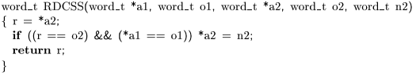
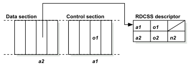

@(thought)[concurrency 并发]

# RDCSS

# RDCSS

RDCSS是Harris提出的一种实现double compare single swap方法，它的语义（也就是DCAS）如下，

# The CAS1 Approach

下面使用CAS1（single word compare single swap）来实现RDCSS。

这是descriptor和两个data section的示意图，

下面是RDCSS的伪代码，

1. **C1：**首先尝试把a2变为descriptor d，如果CAS1成功，那么r == d->o2。

2. **H1：**这步主要是针对C1失败的。如果C1成功，r不是descriptor。如果C1失败，有两种原因（其实是一种，只是分开看），（1）a2的数据被其他thread改为其他的数据，（2）a2被其他thread改为descriptor，那就帮助其他thread完成。

3. **B1：**如果是H1（2），那么帮助其他thread完成以后，retry。

4. **`if(r == d->o2) Complete`：**这步是针对C1成功的。如果C1成功，继续执行。
*在[A practical multi-word compare-and-swap operation - cstheory](http://cstheory.stackexchange.com/questions/7083/a-practical-multi-word-compare-and-swap-operation)里，axel22大神问这步能不能在不改变RDCSS语义的情况下省略。回答是，如果省略**RDCSS的这个部分`if(... && (*a1 == o1)) *a2=n2`就不会执行**。或者运气好的话，其他thread帮助当前thread完成。*

5. **`return r`：**返回a2里老的value，包括执行成功的情况和H1（1）。

# Problem

**C2的if进行比较以后，会不会有其他thread改变o1？**

这里是一直没有想明白的。在看了Ctrie的代码以后，发现在做snapshot的时候，里面的root，mainnode和这里的Data section，Control section是对应的。要是这里存在这个问题，那么Ctrie里也存在（会不会有其他thread改变root里mainnode的reference）。

从Ctrie的角度来看，只要有thread在执行`RDCSS_Complete`，那么root一定是`RDCSS_Descriptor`。而任何thread想要更改root里mainnode，就必须首先read root。所以mainnode不会在某个thread正执行`RDCSS_Complete`的时候被改变。
（在上一篇，Notes of Non-Blocking Snapshots Concurrent Tries的**A detail in `RDCSS_Complete`**部分，有详细的解释。）

再回过头来看这里的RDCSS，这里的Data section会不会相当于就是一个guard，要更改Control section，就必须首先read Data section。这样，在某个thread执行`RDCSS_Complete`的时候，其他thread直接去改变o1就是不可能的。（没有在这篇论文里面找到相关的说明，这里只是自己的理解。）

# References

1. A Practical Multi-Word Compare-and-Swap Operation, Timothy L. Harris, Keir Fraser, Ian A. Pratt
2. [A practical multi-word compare-and-swap operationn - cstheory](http://cstheory.stackexchange.com/questions/7083/a-practical-multi-word-compare-and-swap-operation)